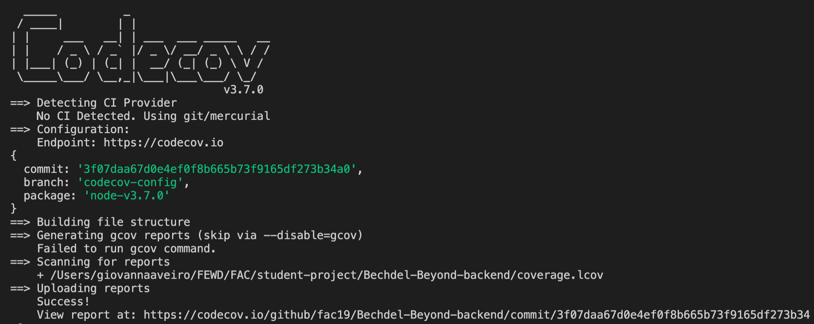

<!-- omit in toc -->
# Codecov with Tape/Node.js

**Content**

- [Setup with Tape in Node.js](#setup-with-tape-in-nodejs)
  - [Generating reports](#generating-reports)
  - [Uploading reports](#uploading-reports)
    - [Not using CI](#not-using-ci)
    - [Using CI (Travis)](#using-ci-travis)
- [Extras](#extras)
- [Resources](#resources)

In a nutshell, [Codecov.io](http://codecov.io) is a tool that integrates code coverage reports making it easy to identify what areas of your code are or are not being tested. It is supported by [lots of languages](https://docs.codecov.io/docs/supported-languages), Javascript/Node.js included. The set up however also varies according to what test runner you are using in your project. For our project Bechdel and Beyond we decided to use Tape in the [backend](https://github.com/fac19/Bechdel-Beyond-backend) and Jest in React for the [front-end](https://github.com/fac19/Bechdel-Beyond). Below I am sharing the steps we took to set up our backend repo in Codecov.

# Setup with Tape in Node.js

If using **Tape** as your test runner you will need some extra tools to implement test coverage. Codecov '[quick start](https://docs.codecov.io/docs/quick-start)' guide recommends Istanbul to generate coverage reports locally that then are sent to Codecov when your branch is pushed to the remote repo. 

## Generating reports

To track the lines of your code being used when your tests run, Codecov recommends installing Istanbul in your development dependencies. I tried following the instructions for Istanbul, but the package is now deprecated and the alternative is Istanbul's command line interface called `nyc` . To install it, run:

 `npm i nyc -D`

In our project we already had a `test` script to run our tests using Tape (and tap-spec to make it pretty):

```json
"test": "PGDATABASE=bbtest tape tests/*.test.js | tap-spec",
```

It is possible to add another script to run it with nyc:

```json
"coverage": "nyc npm run test"
```

Alternatively , you just add nyc to your `test` script:

```json
"test": "PGDATABASE=bbtest nyc tape tests/*.test.js | tap-spec",
```

Running `npm run test`  (or `npm run coverage`) will then show the report below alongside your tests and will generate a `.nyc_output` folders to cache information, all entirely locally.


By default, nyc will look only to the files that are being tested (which can give the illusion of high coverage). Ideally, you want to change this so it covers your entire project and gives you a real picture of what is not being tested. See [here](https://github.com/istanbuljs/nyc#configuring-nyc) how to configure your nyc report.

 

Still according to Codecov instructions, add the script below to your package.json file. It specifies a reporter  and saves all in `coverage.lcov`:  

```json
"report-test": "nyc report --reporter=text-lcov > coverage.lcov && codecov",
```

## Uploading reports

Finally, the  `&& codecov` part is responsible for uploading the report to [Codecov.io](http://codecov.io). For this to work, just install `npm i codecov` in development dependencies. Note that when you start at [codecov.io](http://codecov.io) it suggests you to use a bash command (`- bash <(curl -s [https://codecov.io/bash](https://codecov.io/bash))`). If you decide for codecov npm package (is it safer?), you won't need that.

To test if you can send a report to Codecov, register to [codecov.io](http://codecov.io) with the account where your repo lives and add the token provided at the end of the script above `-t <token>`

Run both scripts (assuming you have tests in your project), `npm run test` then `npm run report-test`. You should see the below in your terminal:



Important! The report will be uploaded to codecov.io only after pushing your branch to the remote. 

Don't forget to include .lcov and .nyc_output in the `.gitignore`

```
coverage
*.lcov

# nyc test coverage
.nyc_output
```

### Not using CI

If you are not using any CI yet, remove the token and `-t` from your package.json and save the token in a `.env` file. Push your branch to the remote and the report will be uploaded to your Codecov dashboard. It might take it some seconds to upload.

### Using CI (Travis)

If using Travis in your project, remove the token and `-t` from your package.json and save the token provided in your project dashboard on Travis. Add both scripts to your `.travis.yml`:

```
script:
  - npm run test
  - npm run report-test
```

And that is it 😉

# Extras

Now that you have done all of this, go to your project dashboard in [codecov.io](http://code.io) > settings > badge and add a coverage badge to share your amazing code coverage in your readme! 

# Resources

Good article about JavaScript testing frameworks: [An Overview of JavaScript Testing in 2020](https://medium.com/welldone-software/an-overview-of-javascript-testing-7ce7298b9870).

You can find more details on what is required for different test runners in NodeJS [here](https://github.com/codecov/example-node). 

[Adding Test Coverage to your NodeJS app with Istanbul, TravisCI, and Codecov](https://medium.com/@erickzhao/adding-test-coverage-to-your-nodejs-app-with-codecov-istanbul-and-travisci-aa092c1e360c)

---

Inputs, comments and suggestions always welcome!</br>
[@glrta](https://github.com/glrta)</br>
to.gio@pm.me